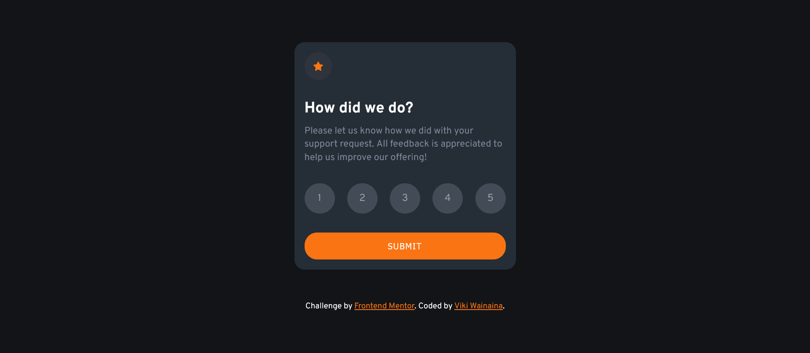

# Frontend Mentor - Interactive rating component

My solution screenshot⤵️

## Welcome! 👋

Thanks for checking out this front-end coding challenge.

[Frontend Mentor](https://www.frontendmentor.io) challenges help you improve your coding skills by building realistic projects.

**To do this challenge, you need a basic understanding of HTML, CSS and JavaScript.**

Your challenge is to build out this interactive rating component.

Users should be able to:

- View the optimal layout for the app depending on their device's screen size
- See hover states for all interactive elements on the page
- Select and submit a number rating
- See the "Thank you" card state after submitting a rating

### Built with

- Semantic HTML5 markup
- CSS custom properties
- Flexbox
- CSS Grid

### Useful resources

- Sourcegrapgh cody -> VScode extension coding assistant
- chatGPT

Coded with ❤️ by (https://twitter.com/vykiddeh_)

**Have fun building!** 🚀
